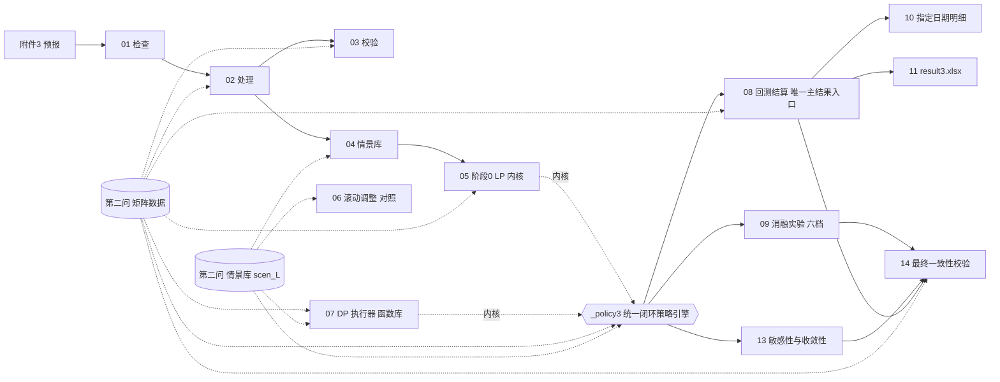

# 第三问 骨架自检报告

- 生成时间：2026-09-12 09:55:36
- 数据来源模式：`real`
- 输出根目录：`第三问最终版`
- 结论：骨架 33/33 通过，接口契约满足 ✔

## 1. 骨架连通性检查

| 检查项 | 结果 | 细节 |
|---|---|---|
| K1 Δt = 1/6 h | ✔ | Δt = 0.1666666667 |
| K2 每日 144 时段 | ✔ | 144 |
| K3 功率上限 S = 5000·Δt | ✔ | S = 833.3333333333 kWh/时段 |
| K4 储能参数自洽 | ✔ | SOC∈[1200,10800]，E_init=6000，η=0.9 |
| K5 评分期 334 天 | ✔ | 预热 31 + 评分 334 |
| K6 τ → 时段索引 k0 = 6τ | ✔ | τ=(0, 6, 12, 18) → k0=[0, 36, 72, 108] |
| K7 四个发布时刻连续覆盖全天 | ✔ | 分段长度 [36, 36, 36] + 末段 36 |
| K8 lead→绝对小时重排正确 | ✔ | 8 个 τ × 24 个绝对小时逐点验证通过 |
| K9 分段常数展开守恒 | ✔ | 最大偏差 0.000e+00 |
| K10 光伏情景能量换算含 Δt | ✔ | 600 kW → 100.000000 kWh/时段 |
| K11 结算三形式等价 | ✔ | ① 11584.000000　② 11584.000000　③ 11584.000000　④ 11584.000000 |
| K12 时间标签口径 | ✔ | t=1 → 00:00-00:10；t=36 → 05:50-06:00；'24:00' → 1440 |
| K13 指定时刻 → 时段索引 | ✔ | '12:00' → 73（即区间 11:50-12:00） |
| K14 无脚本绕过接入层直连第二问 .npz | ✔ | 全部经 C.Q2.matrix() / C.Q2.scenarios() 访问 |
| K15 非 real 模式输出隔离于 _骨架自检/ | ✔ | OUT_ROOT=第三问最终版 |
| K16 接入层模式取值合法 | ✔ | Q3_Q2_SOURCE=real |
| K17 `_policy3` 暴露统一策略入口与结算/测度/残差工具 | ✔ | run_policy / run_arm / summarise / decompose / exante_cost_seg / _residuals |
| K18 08/09 均经 `_policy3` 统一入口调用策略，不自建 LP | ✔ | ✔ 唯一入口 |
| K19 `_policy3` 不加载 06/08/09（单向依赖，无重复实现） | ✔ | ✔ 单向 |
| K20 第二问目录解析唯一且指向现用版本 | ✔ | Q2_DIR=第二问最终版（按候选名自动探测） |
| K20b real 模式下第二问两个 npz 均存在 | ✔ | 矩阵=True 情景=True |
| K21 附录 1 物理常数逐项与文档一致（防共享输入漂移） | ✔ | 13 项全对 |
| K21b 终端价值 ν = 附件 1 前 30 时段均价 / η（逐位复算） | ✔ | 配置 0.4815481481481481 vs 复算 0.48154814814814817 |
| D1 price 形状 (144,) 且全正 | ✔ | shape=(144,)，范围 [0.3713, 1.3952] |
| D2 load_kw / pv_kw 形状一致且非负 | ✔ | shape=(365, 144)，load 均值 4626.0 kW，pv 均值 2311.8 kW |
| D3 量纲哨兵 load_kw / load_energy_kwh ≈ 6 | ✔ | 比值 6.0000（预期 ≈ 1/Δt = 6） |
| D4 天数轴 = 365（31 预热 + 334 评分） | ✔ | n_day = 365，首个评分日下标 31 |
| D5 scen_L 形状与情景数一致 | ✔ | shape=(365, 30, 144)，均值 769.17 kWh/时段 |
| D6 scen_L 与 load_energy 量级一致（同口径） | ✔ | scen_L 均值 / load_energy 均值 = 0.9976 |
| D7 附件 3 与第二问日期数一致 | ✔ | 附件3 365 天 vs 第二问 365 天 |
| D8 情景净负荷相减通路（scen_L − V·Δt） | ✔ | shape=(30, 144)，第 31 天均值 259.21 kWh/时段 |
| D9 闭环残差（2 天冒烟）达到机器精度 | ✔ | max_abs=9.095e-13，信息泄露 0 时段 |
| D10 共同测度下嵌套档期望费用单调非增（2 天冒烟） | ✔ | S0 249,962.9295 元 ≥ S061218 249,266.3498 元（差 +696.5797 元） |

## 2. 接口契约校验

- ✔ `情景库.resid_L` shape=(365, 144)
- ✔ `情景库.scen_L` shape=(365, 30, 144)
- ✔ `情景库.scen_idx` shape=(365, 30)
- ✔ `矩阵数据.dates` shape=(365,)
- ✔ `矩阵数据.delta_hours` shape=(1,)
- ✔ `矩阵数据.load_energy_kwh` shape=(365, 144)
- ✔ `矩阵数据.load_kw` shape=(365, 144)
- ✔ `矩阵数据.net_load_energy_kwh` shape=(365, 144)
- ✔ `矩阵数据.price` shape=(144,)
- ✔ `矩阵数据.pv_energy_kwh` shape=(365, 144)
- ✔ `矩阵数据.pv_kw` shape=(365, 144)
- ✔ `矩阵数据.s_period_kwh` shape=(1,)
- ✔ `矩阵数据.score_day_index` shape=(334,)
- ✔ `矩阵数据.warmup_day_index` shape=(31,)

## 3. 流水线骨架

| 序号 | 用途 | 第二问依赖 | 主要产物 |
|---|---|---|---|
| 01 | 检查附件三原始数据 | 附件 3 | — |
| 02 | 处理附件三基础数据 | 附件 3 + 第二问 dates | 附件三_预报矩阵.npz |
| 03 | 校验附件三处理结果 | 附件 3 + 第二问 pv_kw | — |
| 04 | 构建情景库 | 附件三预报 + 第二问 scen_L/scen_idx | 附件三_情景库.npz |
| 05 | 求解阶段 0 计划（LP 内核，5 种模式） | 第二问 price + 附件三情景 | —（被 `_policy3` 调用） |
| 06 | 滚动调整规划（滚动策略对照） | 第二问 price/scen_L + 阶段0 | 第三问_滚动调整日汇总.csv |
| 07 | 阶段内 DP 执行器（**函数库**） | 第二问 load_kw/pv_kw/scen_L | —（由 `_policy3` 统一调用） |
| _policy3 | ★ 统一闭环策略引擎（唯一策略入口） | 05 + 07 + 第二问 + 附件三 | 内存结果（由 08/09 调用） |
| 08 | ★ 全年回测与结算（唯一主结果入口） | `_policy3.run_policy` + 第二问 price | 第三问_全年回测.npz + 5 CSV + 报告×2（含执行器报告） |
| 09 | 消融实验 | `_policy3.run_arm`（六档共用入口） | 第三问_消融实验对照表.csv + npz + 报告 |
| 10 | 指定日期明细与作图 | 08 + 第二问 price | 4 CSV + 3 图 |
| 11 | 生成并校验 result3.xlsx | 08 + 第二问 load/pv 电量 | 提交结果/result3.xlsx |
| 12 | 端到端编排 | 00–14 | 日志/报告汇总 |
| 13 | 敏感性与收敛性检验 | `_policy3.run_policy(m/nu/delta)` | 3 CSV + npz + 图 + 报告（非交付主结果） |
| 14 | ★ 最终一致性校验（只读交叉复核） | 08 + 09 + 13 产物 + 第二问原始电量 | 1 CSV + 1 报告（不改任何主结果） |

